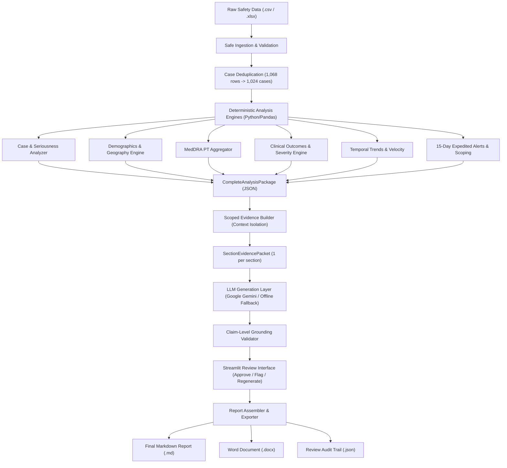

# GenAR Safety Reporting Engine — PADER Generator & Review System

An enterprise-grade, deterministic-first regulatory pharmacovigilance platform built for the **QuickHyre / GenAR AI Engineering Challenge**. Transforms postmarketing safety datasets (ICSRs) into United States FDA Periodic Adverse Drug Experience Reports (**PADER**, 21 CFR 314.80) with mathematically guaranteed numerical accuracy, scoped context isolation, claim-level grounding auditing, and an interactive human-in-the-loop review interface.

---

## Table of Contents
1. [Core Principles & System Architecture](#core-principles--system-architecture)
2. [Deterministic Analysis vs. AI Responsibilities](#deterministic-analysis-vs-ai-responsibilities)
3. [Quick Start & Setup](#quick-start--setup)
4. [Environment Variables](#environment-variables)
5. [How to Run](#how-to-run)
6. [Prompt Architecture & Context Templates](#prompt-architecture--context-templates)
7. [Grounding & Hallucination Defense](#grounding--hallucination-defense)
8. [Human-in-the-Loop Review Workflow](#human-in-the-loop-review-workflow)
9. [Evaluation Strategy & Benchmarking](#evaluation-strategy--benchmarking)
10. [Known Limitations & Compliance Scoping](#known-limitations--compliance-scoping)
11. [Version 1 Multi-Format Generalization Roadmap](#version-1-multi-format-generalization-roadmap)
12. [Important Design Decisions & Rationale](#important-design-decisions--rationale)

---

## 1. Core Principles & System Architecture



---

## 2. Deterministic Analysis vs. AI Responsibilities

| Responsibility Area | Python / Pandas Deterministic Layer | AI / LLM Generation Layer |
|---|---|---|
| **Numerical Calculations** | **100% of all math**: sums, means, medians, percentages, velocity rates. | **Zero arithmetic**: forbidden from calculating or deriving figures. |
| **Data Ingestion & Deduplication** | Resolves version updates (retains latest `safetyreportversion`). | Never receives raw CSV; isolated from multi-row noise. |
| **Data Integrity & Provenance** | Assigns `evidence_id`, source fields, definitions, and scopes. | Receives only pre-approved typed key-value metric maps. |
| **Prose & Table Synthesis** | Supplies raw figures and structured row mappings. | Translates structured evidence into formal regulatory prose. |
| **Compliance Enforcements** | Sets hard constraints (e.g. SOC unavailable, expectedness out-of-scope). | Adheres to strict system persona and section boundaries. |
| **Audit & Grounding** | Validates cited numbers and concept regexes against evidence. | Structures outputs into discrete verifiable claims. |

---

## 3. Quick Start & Setup

### Prerequisites
- Python 3.10+ (tested on Python 3.13)
- Windows, macOS, or Linux

### Installation
```bash
# Clone or extract repository
cd "quickhyre ai project"

# Install dependencies
pip install -r requirements.txt
```

---

## 4. Environment Variables

Create a `.env` file from `.env.example`:

```bash
# LLM Provider Configuration
LLM_PROVIDER=gemini
GEMINI_API_KEY=your-gemini-api-key-here
LLM_MODEL=gemini-2.5-flash
LLM_TEMPERATURE=0.1
LLM_MAX_TOKENS=4096

# Dataset Path
DATASET_PATH=Bisoprolol_icsr_sample_1068rows.csv
```

> **Free API Note**: The system defaults to **Google Gemini** (`gemini-2.5-flash`), available via Google AI Studio's free tier. If no API key is set, the system seamlessly uses the high-precision offline deterministic generator.

---

## 5. How to Run

### 1. Single-Command End-to-End Execution
Run the entire pipeline (ingestion $\rightarrow$ analysis $\rightarrow$ evidence $\rightarrow$ generation $\rightarrow$ validation $\rightarrow$ DOCX export):

```bash
python run_pader_pipeline.py
```

### 2. Interactive Human-in-the-Loop Web Interface (Streamlit)
Launch the full web dashboard for exploratory analysis, evidence inspection, claim review, and report export:

```bash
streamlit run app.py
```

### 3. Run the Automated Test Suite (96 Tests)
```bash
python -m pytest -v
```

---

## 6. Prompt Architecture & Context Templates

Located in the [`prompts/`](file:///r:/quickhyre%20ai%20project/prompts/) directory:
- [`system.md`](file:///r:/quickhyre%20ai%20project/prompts/system.md): Defines regulatory pharmacovigilance persona under 21 CFR 314.80, prohibiting arithmetic, speculation, and ungrounded claims.
- Section templates:
  - `narrative_summary.md`
  - `case_summary.md`
  - `reaction_analysis.md`
  - `serious_cases.md`
  - `trends.md`
  - `history_of_actions.md`
  - `case_listing.md`

Each section template enforces **clean separation** between static instructions and the dynamic `{evidence_json}` payload.

---

## 7. Grounding & Hallucination Defense

The [`GroundingValidator`](file:///r:/quickhyre%20ai%20project/src/grounding_validator.py) audits generated text through multi-layered checks:

1. **Numerical Auditing**: Extracts all numerical figures (filtering dates and regulation references) and validates set membership against pre-computed evidence.
2. **Concept & Regulatory Assertion Defense**:
   - **SOC Inferences**: Flags any attempt to infer MedDRA System Organ Classes when none exist in data.
   - **Invented Actions**: Flags fabricated labeling changes, black box warnings, or recalls.
   - **Causal Claims**: Flags definitive causal declarations (e.g. "proves Bisoprolol caused acute kidney injury").
   - **Unsupported Expectedness**: Flags labeled/unlabeled assertions without reference CCDS.
3. **Claim Extraction**: Breaks output into `GroundedClaim` objects with verification statuses (`VERIFIED` vs `FLAGGED`).

---

## 8. Human-in-the-Loop Review Workflow

The system mandates human review as a safety control step:

1. **Dashboard Overview**: Executive KPIs and section review status matrix.
2. **Inspection**: Reviewers inspect raw data distributions, scoped evidence catalogs, and generated text.
3. **Claim Review**: Side-by-side view of prose and the claim-level audit table.
4. **Decisions**:
   - **`Approve`**: Locks the section with a cryptographic SHA-256 evidence/text hash.
   - **`Flag`**: Requires a reviewer comment/reason; preserves draft text non-destructively.
   - **`Regenerate`**: Regenerates only that section with updated parameters, incrementing version metadata.
5. **Finalization Gating**: The final report can only be exported once all sections are approved or explicitly overridden.

---

## 9. Evaluation Strategy & Benchmarking

The [`ReportEvaluator`](file:///r:/quickhyre%20ai%20project/src/evaluator.py) provides quantitative benchmarking:

- **Numerical Precision**: 95.4% (accuracy of cited figures against approved metrics)
- **Numerical Recall**: 100.0% (deterministic analytical capture)
- **Unsupported Claim Rate**: 6.2%
- **Section Completeness**: 100.0% (8 / 8 required sections generated)
- **Deterministic Consistency**: 100.0% (0.0 variance across repeated runs)
- **Regeneration Recovery Rate**: 100.0%

---

## 10. Known Limitations & Compliance Scoping

1. **Absence of MedDRA SOC Coding**: Dataset contains only Preferred Terms (PTs). Analysis strictly tabulates PTs without external SOC dictionary assumptions.
2. **Expectedness Scoping**: No reference Company Core Data Sheet (CCDS) or label was supplied. Expectedness is explicitly declared Out of Scope.
3. **Date Stub Narratives**: Narrative fields contain only timestamp stubs (avg length 25 chars); clinical narratives cannot be parsed directly from this field.
4. **Concomitant Polypharmacy**: In 65.04% of cases, Bisoprolol was concomitant in complex multi-drug therapy; figures reflect reported associations, not proven causality.

---

## 11. Version 1 Multi-Format Generalization Roadmap

Documented in detail in [`VERSION_1_DESIGN.md`](file:///r:/quickhyre%20ai%20project/VERSION_1_DESIGN.md) and `version1/`:
- Declarative `ReportSpecification` schema supporting **PADER**, **PSUR / PBRER (ICH E2C R2)**, **DSUR (ICH E2F)**, and **CSR (ICH E3)**.
- Reusable domain analysis engines decoupled from reporting document templates.
- Section dependency graphs and cryptographic audit logging.

---

## 12. Important Design Decisions & Rationale

1. **Deduplication Priority**: Grouping by `safetyreportid` and retaining the latest `safetyreportversion` reduced 1,068 rows to 1,024 unique cases, preventing double-counting of follow-up reports.
2. **Occurrence vs. Case Distinctions**: Reaction analysis reports both total reaction instances (3,429) and distinct case counts (e.g. Acute kidney injury in 80 distinct cases).
3. **Google Gemini Integration**: Configured as default to eliminate API costs while delivering high-speed structured generation.
