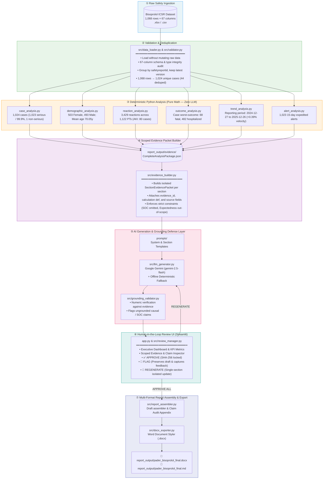
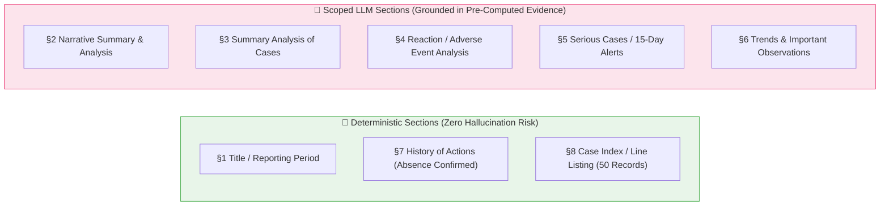
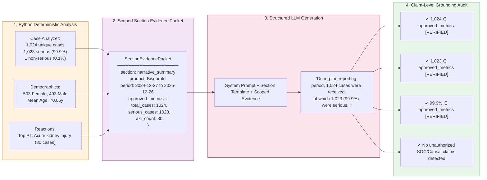

# System Architecture — GenAR PADER Safety Report Generation & Review Platform

An enterprise-grade, deterministic-first regulatory pharmacovigilance platform built for the **QuickHyre / GenAR AI Engineering Challenge**. Transforms postmarketing safety datasets (ICSRs) into United States FDA Periodic Adverse Drug Experience Reports (**PADER**, 21 CFR 314.80) with mathematically guaranteed numerical accuracy, scoped context isolation, claim-level grounding auditing, and an interactive human-in-the-loop review interface.

---

## 1. End-to-End System Pipeline

---

## 2. 8 Standard PADER Report Sections

---

## 3. Scoped Context Isolation & Claim Verification Flow

