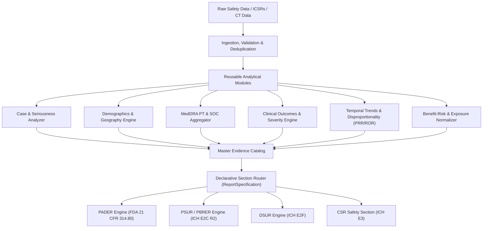

# GenAR Regulatory Safety Reporting Engine: Version 1 Architectural Generalization

## Executive Summary

The GenAR system separates **deterministic mathematical analysis (Python/Pandas)** from **regulatory prose synthesis (LLM with scoped evidence packets)**. This document outlines how this architecture scales from the current **PADER** prototype to a multi-framework regulatory reporting engine supporting **PSUR/PBRER (ICH E2C R2)**, **DSUR (ICH E2F)**, and **CSR (ICH E3)** without rewriting the underlying analysis or grounding infrastructure.

---

## 1. Multi-Format Regulatory Support Matrix



| Regulatory Framework | Target Document | Primary Analytical Additions Needed | Section Routing Changes |
|---|---|---|---|
| **US FDA 21 CFR 314.80** | **PADER** *(Current)* | Baseline (Seriousness, 15-day alerts, Top PTs, Trends) | 8 Standard Sections |
| **ICH E2C (R2) / EMA** | **PSUR / PBRER** | Cumulative patient exposure, Disproportionality (PRR, ROR), SOC hierarchy, Benefit-Risk balance | 20 Sections (adds Exposure, Signal Evaluation, Risk Characterization) |
| **ICH E2F** | **DSUR** | Clinical trial phase breakdown, Treatment arm blinding status, Reference Safety Information (IB/CCSI) matching | 18 Sections (adds Trial Line Listings, DSMB recommendations) |
| **ICH E3** | **CSR (Safety Sec.)** | Treatment-emergent adverse events (TEAEs), Laboratory shift tables, Dose-response grouping | 5 Safety Sections (adds TEAE tables, Vital signs, Lab abnormalities) |

---

## 2. Reusable Analysis Module Architecture

The analytical core is decoupled from document-specific templates. New reporting requirements are supported by adding modular domain analyzers:

1. **`case_analysis`**: Universal unique case deduplication, versioning, seriousness criteria, and drug role attribution (suspect, concomitant, interacting).
2. **`demographic_analysis`**: ISO unit conversions, WHO/ICH age bucketing, sex breakdown, and geographic origin mapping.
3. **`reaction_analysis`**: MedDRA Preferred Term (PT) and System Organ Class (SOC) extraction, dual metrics (total occurrences vs. distinct cases).
4. **`outcome_analysis`**: Event-level outcome vs. case-level worst-case clinical severity hierarchy (`fatal` > `life-threatening` > `hospitalized` > `ongoing` > `resolved`).
5. **`trend_analysis`**: Rolling time-series case velocity, seasonal variations, and signal stability indicators.
6. **`disproportionality_analysis` *(v1.0 Plugin)***: Computes Proportional Reporting Ratio (PRR) and Reporting Odds Ratio (ROR) when comparator background data is available.
7. **`exposure_normalizer` *(v1.0 Plugin)***: Calculates reporting rates per 1,000 Patient-Years of exposure when sales/distribution volume is provided.

---

## 3. Configuration-Driven Section Definitions & Dependency Graphs

Rather than hardcoded scripts, each regulatory report format is declared as a `ReportSpecification`:

```python
PSUR_SPECIFICATION = ReportSpecification(
    report_type="PSUR",
    regulatory_framework="ICH E2C(R2)",
    version="1.0.0",
    sections=[
        SectionDefinition(
            section_id="worldwide_marketing_status",
            title="Section 1: Worldwide Marketing Authorization Status",
            required_analyses=["regulatory_history"],
            generation_mode="deterministic"
        ),
        SectionDefinition(
            section_id="cumulative_patient_exposure",
            title="Section 5: Cumulative Patient Exposure",
            required_analyses=["exposure_normalizer", "demographic_analysis"],
            generation_mode="llm",
            constraints=["Must report rates per 1,000 patient-years. Do not extrapolate beyond provided sales units."]
        ),
        SectionDefinition(
            section_id="signal_and_risk_evaluation",
            title="Section 16: Signal and Risk Evaluation",
            required_analyses=["disproportionality_analysis", "trend_analysis", "outcome_analysis"],
            generation_mode="llm",
            dependencies=["cumulative_patient_exposure"],
            constraints=["Evaluate numerical signal metrics objectively without definitive causal declarations."]
        )
    ]
)
```

---

## 4. End-to-End Tracing, Versioning, and Compliance

To guarantee 21 CFR Part 11 and GAMP 5 regulatory compliance:
- **Data Versioning**: Every ingestion run stores a cryptographic SHA-256 hash of the input dataset and resulting deduplicated records.
- **Evidence Provenance**: Every metric in `CompleteAnalysisPackage` retains its `evidence_id`, exact calculation definition, source field names, scope, and supporting case IDs.
- **Prompt & Model Versioning**: Section prompt templates and LLM model identifiers (e.g. `gemini-2.5-flash@v1.2`) are version-pinned and logged.
- **Audit Logging**: Human reviewer decisions (`APPROVED`, `FLAGGED`, `REGENERATED`) are recorded with timestamps, user identity, reviewer comments, and SHA-256 hashes of the exact text reviewed.

---

## 5. Evaluation-at-Scale Framework

To credibly evaluate the reporting engine across hundreds of product portfolios:

1. **Synthetic Perturbation Benchmarking**: Automated evaluation harness perturbing datasets (e.g. injecting missing dates, simulating volume surges, varying concomitant drug counts) to verify robust error-handling and metric reproducibility.
2. **Deterministic Regression Tests**: 100% bit-for-bit repeatability of mathematical analyses across identical data inputs.
3. **Adversarial Grounding Audits**: Synthetic generation runs injecting intentional hallucinations (e.g. fake SOC terms, ungrounded patient deaths, fabricated label changes) to verify that the `GroundingValidator` catches and flags 100% of unauthorized claims.
4. **Human Review Discrepancy Tracking**: Longitudinal tracking of human reviewer flag rates to identify and refine sections with low initial grounding scores.
